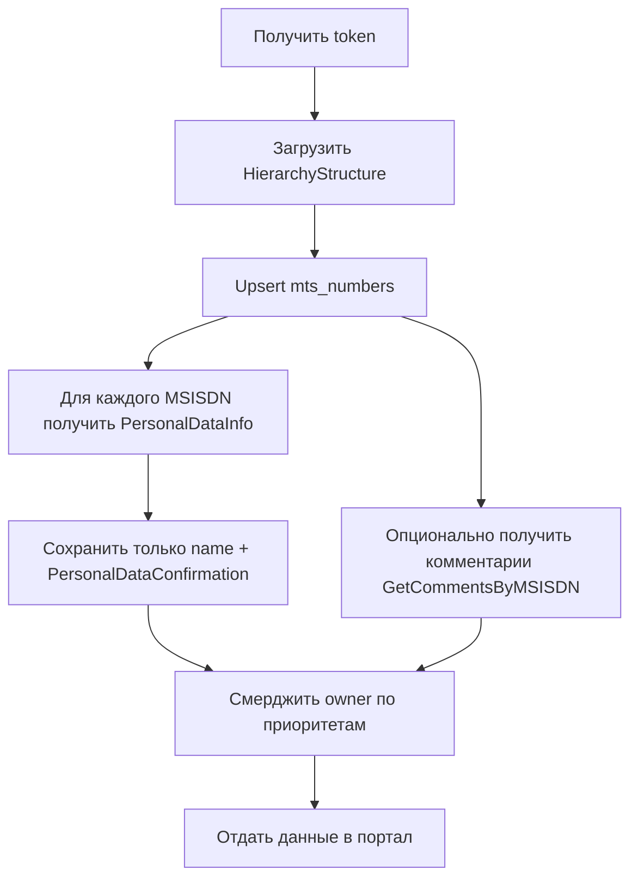

# Интеграция с МТС Бизнес API: получение ФИО, инвентаризация номеров и каталог endpoint

Дата подготовки: 2026-07-06  
Основной источник: публичная документация МТС Поддержки для бизнеса по МТС Бизнес API.  
Базовый URL API: `https://api.mts.ru`.

Документ предназначен для Claude Code: по нему можно реализовать клиент API, синхронизацию номеров в портал, получение ФИО пользователя номера и обработку асинхронных операций.

---

## 1. Главный вывод по проблеме ФИО

### Правильный endpoint для чтения ФИО

Для получения ФИО пользователя номера используйте:

```http
GET /b2b/v1/PersonalData/PersonalDataInfo?contactMedium.phoneNumber={MSISDN}
```

Пример:

```bash
curl --location --request GET \
  'https://api.mts.ru/b2b/v1/PersonalData/PersonalDataInfo?contactMedium.phoneNumber=7XXXXXXXXXX' \
  --header 'Content-Type: application/json' \
  --header 'Accept: application/json' \
  --header 'Authorization: Bearer <access_token>'
```

Пример релевантной части ответа:

```json
[
  {
    "name": "Фамилия Имя Отчество",
    "characteristic": [
      {
        "name": "PersonalDataConfirmation",
        "value": "Activated"
      }
    ]
  }
]
```

Для портала извлекаем только:

```ts
type MtsNumberPersonalData = {
  msisdn: string;
  fullName: string | null;                  // response[0]?.name
  confirmationStatus: string | null;        // characteristic[name=PersonalDataConfirmation]?.value
  fetchedAt: string;
};
```

Не сохраняйте в портал паспортные данные, адрес регистрации, дату рождения и прочие поля из ответа, если для бизнес-процесса достаточно ФИО и статуса. Endpoint возвращает больше персональных данных, чем нужно для отображения владельца номера.

### Почему ФИО не получается через другие endpoint

`/b2b/v1/Service/HierarchyStructure` нужен для инвентаризации структуры клиента: организация, контракт, лицевой счёт, номер, регион, IMSI, SIM/ICCID, ИНН, КПП. Он не предназначен для ФИО пользователя номера.

`/b2b/v1/PersonalData/ChangePersonalData` — endpoint записи/удаления персональных данных. В теле запроса действительно есть `FirstName`, `SecondName`, `SurName`, но это данные, которые мы отправляем в МТС, а не данные, которые endpoint возвращает.

`/b2b/v1/Product/ProductInfo`, endpoint баланса, детализации, тарифов и услуг не возвращают ФИО владельца/пользователя номера.

### Рекомендуемая стратегия для портала

1. **Инвентаризация номеров:** регулярно загружать номера через `HierarchyStructure` с пагинацией и фильтрами `inn`, `contract`, `account`, `msisdn`, `sim`.
2. **Обогащение ФИО:** для каждого активного MSISDN вызывать `PersonalDataInfo`, парсить `name` и `PersonalDataConfirmation`.
3. **Fallback-источник ФИО:** если `PersonalDataInfo` недоступен, пустой или персональные данные не внесены, использовать внутренний HR/AD/портальный справочник `MSISDN -> сотрудник`.
4. **Дополнительный fallback:** читать комментарий номера через `GetCommentsByMSISDN`, если в ЛК МТС уже заведены комментарии с именем/табельным номером. Это не замена персональным данным, а удобное поле заметки.
5. **Не блокировать портал из-за ФИО:** показывать номер даже без ФИО, но помечать `ownerSource: unknown|mts_personal_data|hr|mts_comment|manual`.

### Возможные причины, почему `PersonalDataInfo` не отдаёт ФИО

- Номер передан не в формате `7XXXXXXXXXX`.
- У токена нет доступа к контракту/лицевому счёту/номеру.
- Нет активной подписки на нужный пакет API или endpoint не входит в доступные права.
- Персональные данные по номеру не внесены или не подтверждены.
- В ответе статус `Anonymous`, `Migration`, `WaitingForAcceptance`, `MismatchOfData`, `NotFoundInEsia`, `Refusal` и т.п.
- Не указан `Authorization: Bearer <token>` или токен истёк.
- Превышен лимит запросов: 429 / errorCode 1011.
- В документации многие GET-методы помечают `Content-Type: application/json` как обязательный; добавляйте его даже в GET-запросы.

Статусы `PersonalDataConfirmation`, которые нужно поддержать в коде:

```ts
export type MtsPersonalDataConfirmationStatus =
  | 'Depersonalized'
  | 'NotRequired'
  | 'Migration'
  | 'Anonymous'
  | 'WaitingForAcceptance'
  | 'WaitingForCheck'
  | 'Activated'
  | 'ActivatedPortIn'
  | 'MismatchOfData'
  | 'NotFoundInEsia'
  | 'Refusal'
  | 'RequestNotFoundInEsia'
  | string;
```

Практическая интерпретация:

| Статус | Что делать в портале |
|---|---|
| `Activated` | Можно считать ФИО актуальным по данным МТС. |
| `NotRequired` | Номер не требует персонализации; ФИО может отсутствовать, используйте HR/fallback. |
| `Anonymous`, `Migration` | Данные не внесены или нужна актуализация; не считать отсутствие ФИО ошибкой интеграции. |
| `WaitingForAcceptance`, `WaitingForCheck` | Данные в процессе подтверждения; повторить синхронизацию позже. |
| `MismatchOfData`, `NotFoundInEsia`, `Refusal`, `RequestNotFoundInEsia` | Нужна ручная обработка ответственным сотрудником. |

---

## 2. Подключение, токен и лимиты

### Токен

Endpoint:

```http
POST https://api.mts.ru/token
```

Пример:

```bash
curl --location --request POST 'https://api.mts.ru/token' \
  -u '<Consumer Key>:<Consumer Secret>' \
  --header 'Content-Type: application/x-www-form-urlencoded' \
  --header 'Accept: application/json' \
  --data-urlencode 'grant_type=client_credentials'
```

Ожидаемый ответ:

```json
{
  "access_token": "...",
  "scope": "...",
  "token_type": "Bearer",
  "expires_in": 3600
}
```

Правила реализации:

- Кэшировать токен до `expires_in`.
- Обновлять заранее, например за 5 минут до истечения.
- При `401` + `errorCode: 1013` выполнить один forced refresh и повторить исходный запрос один раз.
- Не логировать `Consumer Secret`, `access_token`, паспортные данные, адреса и ФИО в DEBUG/INFO-логах.

### Лимиты пакета

В документации описаны два пакета:

| Пакет | Ограничение |
|---|---|
| 60 запросов | до 60 запросов/мин и не более 3 запросов/сек |
| 300 запросов | до 300 запросов/мин и не более 10 запросов/сек |

В клиенте обязательно нужен rate limiter. Для массового получения ФИО не запускать параллельно сотни запросов; `PersonalDataInfo` документирован как одиночный запрос по одному `MSISDN`.

---

## 3. Архитектура интеграции в портал

### Таблицы/модели

```sql
-- Инвентарь номеров из МТС
CREATE TABLE mts_numbers (
  msisdn               VARCHAR(11) PRIMARY KEY,
  account_no           VARCHAR(32),
  contract_no          VARCHAR(64),
  organization_name    TEXT,
  inn                  VARCHAR(16),
  kpp                  VARCHAR(16),
  region               TEXT,
  imsi                 VARCHAR(32),
  sim_iccid            VARCHAR(32),
  mts_comment          TEXT,
  is_active            BOOLEAN DEFAULT TRUE,
  fetched_at           TIMESTAMP NOT NULL
);

-- Владелец/пользователь номера в портале
CREATE TABLE portal_number_owners (
  msisdn               VARCHAR(11) PRIMARY KEY,
  full_name            TEXT,
  confirmation_status  VARCHAR(64),
  source               VARCHAR(32) NOT NULL, -- mts_personal_data | hr | mts_comment | manual | unknown
  source_priority      INT NOT NULL,
  updated_at           TIMESTAMP NOT NULL
);
```

### Приоритет источников ФИО

Рекомендуемый порядок зависит от юридической модели компании. Практичный вариант:

1. `hr` или внутренний портал как источник назначения номера сотруднику.
2. `mts_personal_data` как источник юридически внесённых данных пользователя номера.
3. `mts_comment` как вспомогательная заметка.
4. `manual` как ручная правка администратора.
5. `unknown`, если данных нет.

Если нужен именно “юридический пользователь номера по данным МТС”, ставьте `mts_personal_data` выше HR. Если нужен “сотрудник, которому сейчас выдан номер”, ставьте HR выше МТС, потому что персональные данные у оператора могут отставать от фактической передачи SIM внутри компании.

### Pipeline синхронизации



---

## 4. Инструкции для Claude Code по реализации клиента

### Файлы

Создать модуль, например:

```text
src/integrations/mtsBusiness/
  client.ts
  endpoints.ts
  types.ts
  rateLimiter.ts
  tokenStore.ts
  syncNumbers.ts
  syncPersonalData.ts
  README.md
```

### ENV

```bash
MTS_API_BASE_URL=https://api.mts.ru
MTS_CONSUMER_KEY=...
MTS_CONSUMER_SECRET=...
MTS_RATE_LIMIT_RPM=60
MTS_RATE_LIMIT_RPS=3
MTS_ENABLE_PERSONAL_DATA_SYNC=true
```

### Минимальный TypeScript-клиент

```ts
export type MtsClientOptions = {
  baseUrl: string;
  consumerKey: string;
  consumerSecret: string;
  fetchImpl?: typeof fetch;
};

type TokenState = {
  accessToken: string;
  expiresAtMs: number;
};

export class MtsBusinessClient {
  private token: TokenState | null = null;
  private fetchImpl: typeof fetch;

  constructor(private readonly options: MtsClientOptions) {
    this.fetchImpl = options.fetchImpl ?? fetch;
  }

  private async getAccessToken(forceRefresh = false): Promise<string> {
    const now = Date.now();
    if (!forceRefresh && this.token && this.token.expiresAtMs - now > 5 * 60_000) {
      return this.token.accessToken;
    }

    const credentials = Buffer.from(
      `${this.options.consumerKey}:${this.options.consumerSecret}`,
      'utf8'
    ).toString('base64');

    const response = await this.fetchImpl(`${this.options.baseUrl}/token`, {
      method: 'POST',
      headers: {
        Authorization: `Basic ${credentials}`,
        'Content-Type': 'application/x-www-form-urlencoded',
        Accept: 'application/json',
      },
      body: new URLSearchParams({ grant_type: 'client_credentials' }),
    });

    if (!response.ok) {
      throw new Error(`MTS token request failed: HTTP ${response.status}`);
    }

    const data = await response.json() as {
      access_token: string;
      expires_in: number;
      token_type: 'Bearer';
    };

    this.token = {
      accessToken: data.access_token,
      expiresAtMs: now + data.expires_in * 1000,
    };

    return this.token.accessToken;
  }

  private async requestJson<T>(path: string, init: RequestInit = {}, retry = true): Promise<T> {
    const token = await this.getAccessToken(false);
    const response = await this.fetchImpl(`${this.options.baseUrl}${path}`, {
      ...init,
      headers: {
        Accept: 'application/json',
        'Content-Type': 'application/json',
        ...(init.headers ?? {}),
        Authorization: `Bearer ${token}`,
      },
    });

    const text = await response.text();
    const json = text ? safeJsonParse(text) : null;

    if (response.status === 401 && retry && json?.error?.errorCode === 1013) {
      await this.getAccessToken(true);
      return this.requestJson<T>(path, init, false);
    }

    if (!response.ok) {
      throw new MtsApiError(response.status, json, text);
    }

    return json as T;
  }

  async getPersonalDataInfo(msisdn: string) {
    const normalized = normalizeMsisdn(msisdn);
    const data = await this.requestJson<Array<{
      name?: string;
      characteristic?: Array<{ name?: string; value?: string }>;
    }>>(`/b2b/v1/PersonalData/PersonalDataInfo?contactMedium.phoneNumber=${encodeURIComponent(normalized)}`);

    const first = data[0];
    const status = first?.characteristic?.find(c => c.name === 'PersonalDataConfirmation')?.value ?? null;

    return {
      msisdn: normalized,
      fullName: first?.name?.trim() || null,
      confirmationStatus: status,
      fetchedAt: new Date().toISOString(),
    };
  }

  async getHierarchyByMsisdn(msisdn: string) {
    const normalized = normalizeMsisdn(msisdn);
    return this.requestJson<unknown>(`/b2b/v1/Service/HierarchyStructure?msisdn=${encodeURIComponent(normalized)}`);
  }

  async getCommentsByMsisdn(msisdns: string[]) {
    const normalized = msisdns.map(normalizeMsisdn);
    return this.requestJson<Array<{ msisdn: string; comment?: string }>>(
      '/b2b/v1/Service/GetCommentsByMSISDN',
      {
        method: 'POST',
        body: JSON.stringify({ msisdns: normalized }),
      }
    );
  }
}

function normalizeMsisdn(input: string): string {
  const digits = input.replace(/\D/g, '');
  if (digits.length === 11 && digits.startsWith('8')) return `7${digits.slice(1)}`;
  if (digits.length === 11 && digits.startsWith('7')) return digits;
  if (digits.length === 10) return `7${digits}`;
  throw new Error(`Invalid MSISDN format: ${input}`);
}

function safeJsonParse(text: string): any {
  try { return JSON.parse(text); } catch { return null; }
}

export class MtsApiError extends Error {
  constructor(
    public readonly status: number,
    public readonly json: any,
    public readonly rawText: string
  ) {
    super(`MTS API error: HTTP ${status}`);
  }
}
```

### Batch-обработка ФИО

```ts
export async function syncPersonalDataForNumbers(client: MtsBusinessClient, msisdns: string[]) {
  const result: Array<Awaited<ReturnType<MtsBusinessClient['getPersonalDataInfo']>>> = [];

  for (const msisdn of msisdns) {
    try {
      result.push(await client.getPersonalDataInfo(msisdn));
    } catch (error) {
      // Не логировать ФИО/паспортные данные. MSISDN можно маскировать: 7******1234.
      result.push({
        msisdn: normalizeMsisdn(msisdn),
        fullName: null,
        confirmationStatus: 'FETCH_ERROR',
        fetchedAt: new Date().toISOString(),
      });
    }

    // Подставить rate limiter: 3 rps для пакета 60 или 10 rps для пакета 300.
    await sleep(350);
  }

  return result;
}

function sleep(ms: number) {
  return new Promise(resolve => setTimeout(resolve, ms));
}
```

---

## 5. Каталог endpoint и примеры запросов

Ниже перечислены endpoint из разделов документации МТС Бизнес API. В примерах исправлены очевидные опечатки документации вроде `https: //`, дублированного `Authorization: Authorization`, пропущенного `Content-Type` и незакрытых JSON-скобок.

### 5.1 Авторизация

#### POST `/token` — получить access token

```bash
curl --location --request POST 'https://api.mts.ru/token' \
  -u '<Consumer Key>:<Consumer Secret>' \
  --header 'Content-Type: application/x-www-form-urlencoded' \
  --header 'Accept: application/json' \
  --data-urlencode 'grant_type=client_credentials'
```

---

### 5.2 Баланс и начисления

#### GET `/b2b/v1/Bills/CheckBalanceByMSISDN` — баланс номера

```bash
curl --location --request GET \
  'https://api.mts.ru/b2b/v1/Bills/CheckBalanceByMSISDN?fields=MOAF&characteristic.name=MSISDN&characteristic.value=7XXXXXXXXXX' \
  --header 'Content-Type: application/json' \
  --header 'Accept: application/json' \
  --header 'Authorization: Bearer <access_token>'
```

#### GET `/b2b/v1/Bills/CheckBalanceByAccount` — баланс лицевого счёта

```bash
curl --location --request GET \
  'https://api.mts.ru/b2b/v1/Bills/CheckBalanceByAccount?fields=MOAF&accountNo=XXXXXXXXXXXX' \
  --header 'Content-Type: application/json' \
  --header 'Accept: application/json' \
  --header 'Authorization: Bearer <access_token>'
```

#### GET `/b2b/v1/Bills/BillingStatementByMSISDN` — детализация по номеру

```bash
curl --location --request GET \
  'https://api.mts.ru/b2b/v1/Bills/BillingStatementByMSISDN?msisdn=7XXXXXXXXXX&startDateTime=2026-07-01T00:00:00Z&endDateTime=2026-07-02T00:00:00Z' \
  --header 'Content-Type: application/json' \
  --header 'Accept: application/json' \
  --header 'Authorization: Bearer <access_token>'
```

#### GET `/b2b/v1/Bills/BillingStatementByAccount` — детализация по лицевому счёту

Важно: в документации указано ограничение — метод доступен, если на лицевом счёте не более 100 MSISDN.

```bash
curl --location --request GET \
  'https://api.mts.ru/b2b/v1/Bills/BillingStatementByAccount?account=XXXXXXXXXXXX&startDateTime=2026-07-01T00:00:00Z&endDateTime=2026-07-02T00:00:00Z' \
  --header 'Content-Type: application/json' \
  --header 'Accept: application/json' \
  --header 'Authorization: Bearer <access_token>'
```

#### GET `/b2b/v1/Bills/BillingStatementExtdByMSISDN` — расширенная детализация по номеру

```bash
curl --location --request GET \
  'https://api.mts.ru/b2b/v1/Bills/BillingStatementExtdByMSISDN?msisdn=7XXXXXXXXXX&startDateTime=2026-07-01T00:00:00Z&endDateTime=2026-07-02T00:00:00Z' \
  --header 'Content-Type: application/json' \
  --header 'Accept: application/json' \
  --header 'Authorization: Bearer <access_token>'
```

#### GET `/b2b/v1/Bills/BillingStatementExtdByAccount` — расширенная детализация по лицевому счёту

Важно: в документации указано ограничение — метод доступен, если на лицевом счёте не более 100 MSISDN.

```bash
curl --location --request GET \
  'https://api.mts.ru/b2b/v1/Bills/BillingStatementExtdByAccount?account=XXXXXXXXXXXX&startDateTime=2026-07-01T00:00:00Z&endDateTime=2026-07-02T00:00:00Z' \
  --header 'Content-Type: application/json' \
  --header 'Accept: application/json' \
  --header 'Authorization: Bearer <access_token>'
```

#### GET `/b2b/v1/Bills/ValidityInfo` — остатки пакетов минут, SMS и интернета

```bash
curl --location --request GET \
  'https://api.mts.ru/b2b/v1/Bills/ValidityInfo?fields=MOAF,forisCounters,h2oProfile,ReturnServices,ReturnAutoExtention&customerAccount.accountNo=7XXXXXXXXXX&customerAccount.productRelationship.product.productLine.name=Counters' \
  --header 'Content-Type: application/json' \
  --header 'Accept: application/json' \
  --header 'Authorization: Bearer <access_token>'
```

Поддерживаемые `fields`: `MOAF`, `h2oProfile`, `forisCounters`, `ReturnServices`, `ReturnAutoExtention`.

#### POST `/b2b/v1/Bills/CheckCharges` — начисления по номеру

Один номер:

```bash
curl --location --request POST \
  'https://api.mts.ru/b2b/v1/Bills/CheckCharges' \
  --header 'Content-Type: application/json' \
  --header 'Accept: application/json' \
  --header 'Authorization: Bearer <access_token>' \
  --data-raw '[{"id":"7XXXXXXXXXX"}]'
```

Несколько номеров, до 1000 значений:

```bash
curl --location --request POST \
  'https://api.mts.ru/b2b/v1/Bills/CheckCharges?isBulk=true' \
  --header 'Content-Type: application/json' \
  --header 'Accept: application/json' \
  --header 'Authorization: Bearer <access_token>' \
  --data-raw '[{"id":"7XXXXXXXXXX"},{"id":"7YYYYYYYYYY"}]'
```

#### POST `/b2b/v1/Bills/GetUnpaidAmountByAccountNumber` — сумма неоплаченных счетов

```bash
curl --location --request POST \
  'https://api.mts.ru/b2b/v1/Bills/GetUnpaidAmountByAccountNumber' \
  --header 'Content-Type: application/json' \
  --header 'Accept: application/json' \
  --header 'Authorization: Bearer <access_token>' \
  --data-raw '["XXXXXXXXXXXX", "YYYYYYYYYYYY"]'
```

---

### 5.3 Информация об услугах и блокировках

Все следующие запросы используют `/b2b/v1/Product/ProductInfo` с разными query-параметрами.

#### GET `/b2b/v1/Product/ProductInfo` — подключённые услуги

```bash
curl --location --request GET \
  'https://api.mts.ru/b2b/v1/Product/ProductInfo?category.name=MobileConnectivity&marketSegment.characteristic.name=MSISDN&marketSegment.characteristic.value=7XXXXXXXXXX&productOffering.actionAllowed=none&productOffering.productSpecification.productSpecificationType.name=service&applyTimeZone=true' \
  --header 'Content-Type: application/json' \
  --header 'Accept: application/json' \
  --header 'Authorization: Bearer <access_token>'
```

#### GET `/b2b/v1/Product/ProductInfo` — подключённые услуги со стоимостью

```bash
curl --location --request GET \
  'https://api.mts.ru/b2b/v1/Product/ProductInfo?category.name=MobileConnectivity&marketSegment.characteristic.name=MSISDN&marketSegment.characteristic.value=7XXXXXXXXXX&productOffering.actionAllowed=none&productOffering.productSpecification.productSpecificationType.name=service&fields=CalculatePrices&applyTimeZone=true' \
  --header 'Content-Type: application/json' \
  --header 'Accept: application/json' \
  --header 'Authorization: Bearer <access_token>'
```

#### GET `/b2b/v1/Product/ProductInfo` — подключённые блокировки

```bash
curl --location --request GET \
  'https://api.mts.ru/b2b/v1/Product/ProductInfo?category.name=MobileConnectivity&marketSegment.characteristic.name=MSISDN&marketSegment.characteristic.value=7XXXXXXXXXX&productOffering.actionAllowed=none&productOffering.productSpecification.productSpecificationType.name=block&applyTimeZone=true' \
  --header 'Content-Type: application/json' \
  --header 'Accept: application/json' \
  --header 'Authorization: Bearer <access_token>'
```

#### GET `/b2b/v1/Product/ProductInfo` — доступные услуги

```bash
curl --location --request GET \
  'https://api.mts.ru/b2b/v1/Product/ProductInfo?category.name=MobileConnectivity&marketSegment.characteristic.name=MSISDN&marketSegment.characteristic.value=7XXXXXXXXXX&productOffering.actionAllowed=create&productOffering.productSpecification.productSpecificationType.name=service&applyTimeZone=true' \
  --header 'Content-Type: application/json' \
  --header 'Accept: application/json' \
  --header 'Authorization: Bearer <access_token>'
```

#### GET `/b2b/v1/Product/ProductInfo` — доступные блокировки

```bash
curl --location --request GET \
  'https://api.mts.ru/b2b/v1/Product/ProductInfo?category.name=MobileConnectivity&marketSegment.characteristic.name=MSISDN&marketSegment.characteristic.value=7XXXXXXXXXX&productOffering.actionAllowed=create&productOffering.productSpecification.productSpecificationType.name=block&applyTimeZone=true' \
  --header 'Content-Type: application/json' \
  --header 'Accept: application/json' \
  --header 'Authorization: Bearer <access_token>'
```

#### PATCH `/b2b/v1/Product/ModifyProduct` — проверить возможность добавления услуги

```bash
curl --location --request PATCH \
  'https://api.mts.ru/b2b/v1/Product/ModifyProduct?msisdn=7XXXXXXXXXX' \
  --header 'Content-Type: application/json' \
  --header 'Accept: application/json' \
  --header 'Authorization: Bearer <access_token>' \
  --data-raw '{
    "characteristic": [{ "name": "ValidateMobileConnectivity" }],
    "item": [{
      "action": "create",
      "product": {
        "externalID": "PEXXXX",
        "productCharacteristic": [{
          "name": "ResourceServiceRequestItemType",
          "value": "ResourceServiceRequestItem"
        }]
      }
    }]
  }'
```

---

### 5.4 Управление услугами и добровольной блокировкой

#### POST `/b2b/v1/Product/ModifyProduct` — добавить услугу

```bash
curl --location --request POST \
  'https://api.mts.ru/b2b/v1/Product/ModifyProduct?msisdn=7XXXXXXXXXX' \
  --header 'Content-Type: application/json' \
  --header 'Accept: application/json' \
  --header 'Authorization: Bearer <access_token>' \
  --data-raw '{
    "characteristic": [{ "name": "MobileConnectivity" }],
    "item": [{
      "action": "create",
      "product": {
        "externalID": "PEXXXX",
        "productCharacteristic": [{
          "name": "ResourceServiceRequestItemType",
          "value": "ResourceServiceRequestItem"
        }]
      }
    }]
  }'
```

#### POST `/b2b/v1/Product/ModifyProduct` — добавить услугу с отложенной датой

```bash
curl --location --request POST \
  'https://api.mts.ru/b2b/v1/Product/ModifyProduct?msisdn=7XXXXXXXXXX' \
  --header 'Content-Type: application/json' \
  --header 'Accept: application/json' \
  --header 'Authorization: Bearer <access_token>' \
  --data-raw '{
    "characteristic": [{ "name": "MobileConnectivity" }],
    "item": [{
      "action": "create",
      "actionDate": "2026-07-10T00:00:00",
      "product": {
        "externalID": "PEXXXX",
        "productCharacteristic": [{
          "name": "ResourceServiceRequestItemType",
          "value": "DelayedResourceServiceRequestItem"
        }]
      }
    }]
  }'
```

#### POST `/b2b/v1/Product/ModifyProduct` — удалить услугу

```bash
curl --location --request POST \
  'https://api.mts.ru/b2b/v1/Product/ModifyProduct?msisdn=7XXXXXXXXXX' \
  --header 'Content-Type: application/json' \
  --header 'Accept: application/json' \
  --header 'Authorization: Bearer <access_token>' \
  --data-raw '{
    "characteristic": [{ "name": "MobileConnectivity" }],
    "item": [{
      "action": "delete",
      "product": {
        "externalID": "PEXXXX",
        "productCharacteristic": [{
          "name": "ResourceServiceRequestItemType",
          "value": "ResourceServiceRequestItem"
        }]
      }
    }]
  }'
```

#### POST `/b2b/v1/Product/ModifyProduct` — удалить услугу с отложенной датой

```bash
curl --location --request POST \
  'https://api.mts.ru/b2b/v1/Product/ModifyProduct?msisdn=7XXXXXXXXXX' \
  --header 'Content-Type: application/json' \
  --header 'Accept: application/json' \
  --header 'Authorization: Bearer <access_token>' \
  --data-raw '{
    "characteristic": [{ "name": "MobileConnectivity" }],
    "item": [{
      "action": "delete",
      "actionDate": "2026-07-10T00:00:00",
      "product": {
        "externalID": "PEXXXX",
        "productCharacteristic": [{
          "name": "ResourceServiceRequestItemType",
          "value": "DelayedResourceServiceRequestItem"
        }]
      }
    }]
  }'
```

#### POST `/b2b/v1/Product/ModifyProduct` — подключить добровольную блокировку

В документации для добровольной блокировки используется `externalID: BL0005`.

```bash
curl --location --request POST \
  'https://api.mts.ru/b2b/v1/Product/ModifyProduct?msisdn=7XXXXXXXXXX' \
  --header 'Content-Type: application/json' \
  --header 'Accept: application/json' \
  --header 'Authorization: Bearer <access_token>' \
  --data-raw '{
    "characteristic": [{ "name": "MobileConnectivity" }],
    "item": [{
      "action": "create",
      "product": {
        "externalID": "BL0005",
        "productCharacteristic": [{
          "name": "ResourceServiceRequestItemType",
          "value": "ResourceServiceRequestItem"
        }]
      }
    }]
  }'
```

Для отложенной даты используйте `actionDate` и `DelayedResourceServiceRequestItem`. Для удаления блокировки используйте `action: delete` и `externalID: BL0005`.

---

### 5.5 Комментарии по номерам и лицевым счетам

#### POST `/b2b/v1/Service/GetCommentsByMSISDN` — прочитать комментарии номеров

До 300 MSISDN в запросе.

```bash
curl --location --request POST \
  'https://api.mts.ru/b2b/v1/Service/GetCommentsByMSISDN' \
  --header 'Content-Type: application/json' \
  --header 'Accept: application/json' \
  --header 'Authorization: Bearer <access_token>' \
  --data-raw '{"msisdns":["7XXXXXXXXXX","7YYYYYYYYYY"]}'
```

Ответ:

```json
[
  { "msisdn": "7XXXXXXXXXX", "comment": "Иванов Иван" }
]
```

#### POST `/b2b/v1/Service/GetCommentsByAccount` — прочитать комментарии лицевых счетов

До 300 лицевых счетов в запросе.

```bash
curl --location --request POST \
  'https://api.mts.ru/b2b/v1/Service/GetCommentsByAccount' \
  --header 'Content-Type: application/json' \
  --header 'Accept: application/json' \
  --header 'Authorization: Bearer <access_token>' \
  --data-raw '{"accounts":["XXXXXXXXXXXX","YYYYYYYYYYYY"]}'
```

#### POST `/b2b/v1/Service/SetCommentsByMSISDN` — добавить или удалить комментарий на номере

Комментарий на номере — до 200 символов. Удаление — передать пустую строку.

```bash
curl --location --request POST \
  'https://api.mts.ru/b2b/v1/Service/SetCommentsByMSISDN' \
  --header 'Content-Type: application/json' \
  --header 'Accept: application/json' \
  --header 'Authorization: Bearer <access_token>' \
  --data-raw '{"comment":"Иванов Иван / отдел продаж","msisdns":["7XXXXXXXXXX"]}'
```

Удаление:

```bash
curl --location --request POST \
  'https://api.mts.ru/b2b/v1/Service/SetCommentsByMSISDN' \
  --header 'Content-Type: application/json' \
  --header 'Accept: application/json' \
  --header 'Authorization: Bearer <access_token>' \
  --data-raw '{"comment":"","msisdns":["7XXXXXXXXXX"]}'
```

#### POST `/b2b/v1/Service/SetCommentsByAccount` — добавить или удалить комментарий на лицевом счёте

Комментарий на лицевом счёте — до 100 символов.

```bash
curl --location --request POST \
  'https://api.mts.ru/b2b/v1/Service/SetCommentsByAccount' \
  --header 'Content-Type: application/json' \
  --header 'Accept: application/json' \
  --header 'Authorization: Bearer <access_token>' \
  --data-raw '{"comment":"Филиал Москва","accounts":["XXXXXXXXXXXX"]}'
```

---

### 5.6 Переадресация

#### GET `/b2b/v1/Product/CallForwardingInfo` — посмотреть правила переадресации

```bash
curl --location --request GET \
  'https://api.mts.ru/b2b/v1/Product/CallForwardingInfo?productCharacteristic.name=MSISDN&productCharacteristic.value=7XXXXXXXXXX&productLine.name=CallForwarding' \
  --header 'Content-Type: application/json' \
  --header 'Accept: application/json' \
  --header 'Authorization: Bearer <access_token>'
```

`ForwardingType`: `CFU`, `CFB`, `CFNRY`, `CFNRC`.

#### POST `/b2b/v1/Product/ChangeCallForwarding` — включить переадресацию

```bash
curl --location --request POST \
  'https://api.mts.ru/b2b/v1/Product/ChangeCallForwarding' \
  --header 'Content-Type: application/json' \
  --header 'Accept: application/json' \
  --header 'Authorization: Bearer <access_token>' \
  --data-raw '{
    "characteristic": [{ "name": "MSISDN", "value": "7XXXXXXXXXX" }],
    "item": [{
      "action": "create",
      "product": {
        "productLine": { "name": "CallForwarding" },
        "productCharacteristic": [
          { "name": "ForwardingAddress", "value": "7YYYYYYYYYY" },
          { "name": "ForwardingType", "value": "CFU" },
          { "name": "NoReplyTimer", "value": "30" },
          { "name": "NumType", "value": "international" }
        ]
      }
    }],
    "relatedParty": [{
      "type": "Individual",
      "location": { "id": "000000000" },
      "role": "point-of-sale"
    }]
  }'
```

#### POST `/b2b/v1/Product/ChangeCallForwarding` — отключить переадресацию

Используйте тот же body, но `item[0].action = "delete"`.

---

### 5.7 Управление тарифом

#### GET `/b2b/v1/Product/BillPlanInfo` — текущий тариф

```bash
curl --location --request GET \
  'https://api.mts.ru/b2b/v1/Product/BillPlanInfo?productCharacteristic.name=MSISDN&productCharacteristic.value=7XXXXXXXXXX&fields=productCharacteristic,place.role,place.externalID,productOffering.name,productOffering.href,productOffering.externalID,productOffering.validFor,TariffProductWithRegionalTariff,RegionalTariffInfo&productLine.name=MobileConnectivity' \
  --header 'Content-Type: application/json' \
  --header 'Accept: application/json' \
  --header 'Authorization: Bearer <access_token>'
```

#### POST `/b2b/v1/Product/ChangeBillPlanValidation` — проверить смену тарифа

```bash
curl --location --request POST \
  'https://api.mts.ru/b2b/v1/Product/ChangeBillPlanValidation?msisdn=7XXXXXXXXXX' \
  --header 'Content-Type: application/json' \
  --header 'Accept: application/json' \
  --header 'Authorization: Bearer <access_token>' \
  --data-raw '{
    "item": [{
      "product": {
        "externalID": "TPXXXX",
        "productCharacteristic": [{ "name": "productType", "value": "tariffPlan" }]
      }
    }]
  }'
```

#### POST `/b2b/v1/Product/ChangeBillPlan` — сменить тариф

```bash
curl --location --request POST \
  'https://api.mts.ru/b2b/v1/Product/ChangeBillPlan?msisdn=7XXXXXXXXXX' \
  --header 'Content-Type: application/json' \
  --header 'Accept: application/json' \
  --header 'Authorization: Bearer <access_token>' \
  --data-raw '{
    "item": [{
      "product": {
        "externalID": "TPXXXX",
        "productCharacteristic": [{ "name": "productType", "value": "tariffPlan" }]
      }
    }]
  }'
```

#### GET `/b2b/v1/Bills/TariffRental` — плата по тарифу

```bash
curl --location --request GET \
  'https://api.mts.ru/b2b/v1/Bills/TariffRental?msisdn=7XXXXXXXXXX' \
  --header 'Content-Type: application/json' \
  --header 'Accept: application/json' \
  --header 'Authorization: Bearer <access_token>'
```

#### GET `/b2b/v1/Product/ProductInfo` — тарифы, на которые можно перейти

В документации категория написана с опечаткой `AvailibleTariffPlann`; используйте значение как в документации, если API его ожидает.

```bash
curl --location --request GET \
  'https://api.mts.ru/b2b/v1/Product/ProductInfo?marketSegment.characteristic.name=MSISDN&marketSegment.characteristic.value=7XXXXXXXXXX&fields=productOffering.externalId,productOffering.productOfferingPrice.price&category.name=AvailibleTariffPlann' \
  --header 'Content-Type: application/json' \
  --header 'Accept: application/json' \
  --header 'Authorization: Bearer <access_token>'
```

---

### 5.8 EventID / messageId и асинхронные операции

#### POST `/b2b/v1/Product/CheckRequestStatus` — проверить статус заявки по MSISDN + EventID/messageId

```bash
curl --location --request POST \
  'https://api.mts.ru/b2b/v1/Product/CheckRequestStatus' \
  --header 'Content-Type: application/json' \
  --header 'Accept: application/json' \
  --header 'Authorization: Bearer <access_token>' \
  --data-raw '{
    "relatedParty": [
      { "characteristic": [{ "name": "MSISDN", "value": "7XXXXXXXXXX" }] },
      { "id": "EVENT_OR_MESSAGE_ID" }
    ],
    "validFor": {
      "startDateTime": "2026-07-06T00:00:00",
      "endDateTime": "2026-07-06T23:59:59"
    }
  }'
```

Ограничение документации: период между `startDateTime` и `endDateTime` не должен превышать один день.

#### POST `/b2b/v1/Product/CheckRequestStatus` — получить список заявок за период

```bash
curl --location --request POST \
  'https://api.mts.ru/b2b/v1/Product/CheckRequestStatus' \
  --header 'Content-Type: application/json' \
  --header 'Accept: application/json' \
  --header 'Authorization: Bearer <access_token>' \
  --data-raw '{
    "relatedParty": [
      { "characteristic": [{ "name": "MSISDN", "value": "7XXXXXXXXXX" }] }
    ],
    "validFor": {
      "startDateTime": "2026-07-06T00:00:00",
      "endDateTime": "2026-07-06T23:59:59"
    }
  }'
```

#### POST `/b2b/v1/Product/CheckRequestStatusByUUID` — проверить заявку только по UUID

```bash
curl --location --request POST \
  'https://api.mts.ru/b2b/v1/Product/CheckRequestStatusByUUID' \
  --header 'Content-Type: application/json' \
  --header 'Accept: application/json' \
  --header 'Authorization: Bearer <access_token>' \
  --data-raw '{
    "relatedParty": [
      { "characteristic": [] },
      { "id": "EVENT_OR_MESSAGE_ID" }
    ],
    "validFor": {
      "startDateTime": "2026-07-06T00:00:00",
      "endDateTime": "2026-07-06T23:59:59"
    }
  }'
```

#### POST `/b2b/v1/Operations/GetStatus` — статус замены SIM/eSIM и корпоративного бюджета

```bash
curl --location --request POST \
  'https://api.mts.ru/b2b/v1/Operations/GetStatus' \
  --header 'Content-Type: application/json' \
  --header 'Accept: application/json' \
  --header 'Authorization: Bearer <access_token>' \
  --data-raw '{"eventId":"EVENT_ID"}'
```

---

### 5.9 Номера в роуминге

#### GET `/b2b/v1/Service/CurrentSubscriberLocation` — информация о SIM в международном роуминге

```bash
curl --location --request GET \
  'https://api.mts.ru/b2b/v1/Service/CurrentSubscriberLocation?msisdn=7XXXXXXXXXX' \
  --header 'Content-Type: application/json' \
  --header 'Accept: application/json' \
  --header 'Authorization: Bearer <access_token>'
```

---

### 5.10 Информация о номерах и лицевых счетах: `HierarchyStructure`

#### GET `/b2b/v1/Service/HierarchyStructure` — вся доступная структура

```bash
curl --location --request GET \
  'https://api.mts.ru/b2b/v1/Service/HierarchyStructure?pageNum=1&pageSize=1000' \
  --header 'Content-Type: application/json' \
  --header 'Accept: application/json' \
  --header 'Authorization: Bearer <access_token>'
```

Если в ответе есть `hasMore`, продолжайте пагинацию. Максимальный `pageSize`, указанный в документации, — 1000.

#### GET `/b2b/v1/Service/HierarchyStructure?inn=...` — структура по ИНН

```bash
curl --location --request GET \
  'https://api.mts.ru/b2b/v1/Service/HierarchyStructure?inn=XXXXXXXXXX&pageNum=1&pageSize=1000' \
  --header 'Content-Type: application/json' \
  --header 'Accept: application/json' \
  --header 'Authorization: Bearer <access_token>'
```

#### GET `/b2b/v1/Service/HierarchyStructure?contract=...` — структура по номеру контракта

```bash
curl --location --request GET \
  'https://api.mts.ru/b2b/v1/Service/HierarchyStructure?contract=XXXXXXXXXXXX&pageNum=1&pageSize=1000' \
  --header 'Content-Type: application/json' \
  --header 'Accept: application/json' \
  --header 'Authorization: Bearer <access_token>'
```

#### GET `/b2b/v1/Service/HierarchyStructure?account=...` — структура по лицевому счёту

```bash
curl --location --request GET \
  'https://api.mts.ru/b2b/v1/Service/HierarchyStructure?account=XXXXXXXXXXXX&pageNum=1&pageSize=1000' \
  --header 'Content-Type: application/json' \
  --header 'Accept: application/json' \
  --header 'Authorization: Bearer <access_token>'
```

#### GET `/b2b/v1/Service/HierarchyStructure?msisdn=...` — структура по номеру

```bash
curl --location --request GET \
  'https://api.mts.ru/b2b/v1/Service/HierarchyStructure?msisdn=7XXXXXXXXXX' \
  --header 'Content-Type: application/json' \
  --header 'Accept: application/json' \
  --header 'Authorization: Bearer <access_token>'
```

#### GET `/b2b/v1/Service/HierarchyStructure?sim=...` — структура по SIM/ICCID

```bash
curl --location --request GET \
  'https://api.mts.ru/b2b/v1/Service/HierarchyStructure?sim=XXXXXXXXXXXXXXXXXXXX' \
  --header 'Content-Type: application/json' \
  --header 'Accept: application/json' \
  --header 'Authorization: Bearer <access_token>'
```

Поля, которые полезно извлекать из ответа: `name` организации, `id` контракта, `accountNo`, регион, `productSerialNumber` как MSISDN, `IMSI`, `SIM`, `INN`, `KPP`.

---

### 5.11 Доставка счетов

#### GET `/b2b/v1/Bills/DocumentDeliveryMethodByAccount` — метод доставки по лицевому счёту

```bash
curl --location --request GET \
  'https://api.mts.ru/b2b/v1/Bills/DocumentDeliveryMethodByAccount?accountNo=XXXXXXXXXXXX&productRelationship.productLine.name=BillDeliveries&customer.relatedParty.characteristic.name=Activate&customer.relatedParty.characteristic.value=true' \
  --header 'Content-Type: application/json' \
  --header 'Accept: application/json' \
  --header 'Authorization: Bearer <access_token>'
```

#### GET `/b2b/v1/Bills/DocumentDeliveryMethodByMSISDN` — метод доставки по MSISDN

```bash
curl --location --request GET \
  'https://api.mts.ru/b2b/v1/Bills/DocumentDeliveryMethodByMSISDN?customer.relatedParty.characteristic.name=MSISDN&customer.relatedParty.characteristic.value=7XXXXXXXXXX&productRelationship.productLine.name=BillDeliveries' \
  --header 'Content-Type: application/json' \
  --header 'Accept: application/json' \
  --header 'Authorization: Bearer <access_token>'
```

#### POST `/b2b/v1/Bills/DocumentDeliveryMethodByAccount` — добавить доставку на email

```bash
curl --location --request POST \
  'https://api.mts.ru/b2b/v1/Bills/DocumentDeliveryMethodByAccount' \
  --header 'Content-Type: application/json' \
  --header 'Accept: application/json' \
  --header 'Authorization: Bearer <access_token>' \
  --data-raw '{
    "actionAllowed": [{ "value": "create" }],
    "accountNo": "XXXXXXXXXXXX",
    "productRelationship": [{ "product": { "productLine": { "name": "ChangeBillDelivery" } } }],
    "customer": {
      "relatedParty": {
        "characteristic": [
          { "name": "DeliveryContact.Type", "value": "6" },
          { "name": "DeliveryContact.Value", "value": "user@example.com" },
          { "name": "SubType.Code", "value": "355" },
          { "name": "Type.Code", "value": "59" },
          { "name": "BillDelivery.Format", "value": "Pdf" }
        ]
      }
    }
  }'
```

#### POST `/b2b/v1/Bills/DocumentDeliveryMethodByAccount` — изменить email доставки

Используйте `actionAllowed.value = "update"` и добавьте `DeliveryId.ForisLocalId`, полученный из текущего метода доставки.

```bash
curl --location --request POST \
  'https://api.mts.ru/b2b/v1/Bills/DocumentDeliveryMethodByAccount' \
  --header 'Content-Type: application/json' \
  --header 'Accept: application/json' \
  --header 'Authorization: Bearer <access_token>' \
  --data-raw '{
    "actionAllowed": [{ "value": "update" }],
    "accountNo": "XXXXXXXXXXXX",
    "productRelationship": [{ "product": { "productLine": { "name": "ChangeBillDelivery" } } }],
    "customer": {
      "relatedParty": {
        "characteristic": [
          { "name": "DeliveryId.ForisLocalId", "value": "DELIVERY_ID" },
          { "name": "SubType.Code", "value": "355" },
          { "name": "Type.Code", "value": "59" },
          { "name": "DeliveryContact.Type", "value": "6" },
          { "name": "DeliveryContact.Value", "value": "new@example.com" },
          { "name": "BillDelivery.Format", "value": "Pdf" }
        ]
      }
    }
  }'
```

#### POST `/b2b/v1/Bills/DocumentDeliveryMethodByAccount` — удалить дополнительный email

```bash
curl --location --request POST \
  'https://api.mts.ru/b2b/v1/Bills/DocumentDeliveryMethodByAccount' \
  --header 'Content-Type: application/json' \
  --header 'Accept: application/json' \
  --header 'Authorization: Bearer <access_token>' \
  --data-raw '{
    "actionAllowed": [{ "value": "delete" }],
    "accountNo": "XXXXXXXXXXXX",
    "productRelationship": [{ "product": { "productLine": { "name": "ChangeBillDelivery" } } }],
    "customer": {
      "relatedParty": {
        "characteristic": [
          { "name": "DeliveryId.ForisLocalId", "value": "DELIVERY_ID" },
          { "name": "DeliveryContact.Type", "value": "6" }
        ]
      }
    }
  }'
```

---

### 5.12 Персональные данные пользователя номера

#### POST `/b2b/v1/PersonalData/ChangePersonalData` — внести персональные данные гражданина РФ

```bash
curl --location --request POST \
  'https://api.mts.ru/b2b/v1/PersonalData/ChangePersonalData' \
  --header 'x-soap-action: "http://schemas.sitels.ru/FORIS/IL/JsonApi/IResourceOperations%ChangeUserPhysicalResourceBulk"' \
  --header 'X-MTS-MSISDN: 7XXXXXXXXXX' \
  --header 'Content-Type: application/json' \
  --header 'Accept: application/json' \
  --header 'Authorization: Bearer <access_token>' \
  --data-raw '{
    "request": {
      "Items": [{
        "Msisdn": "7XXXXXXXXXX",
        "UserData": {
          "Action": "Create",
          "Addresses": [{
            "Country": "Россия",
            "Region": "Москва",
            "City": "Москва",
            "Street": "Тверская",
            "Home": "1",
            "Apartment": "1",
            "Zip": "000000",
            "AddressTypes": "RegAddress"
          }],
          "LegalCategory": { "Code": "1" },
          "Birthday": "1990-01-01T00:00:00",
          "BirthPlace": "Москва",
          "Gender": "Male",
          "Identifications": [{
            "Action": "Create",
            "DocumentType": { "Code": "21" },
            "Country": { "Code": "RU" },
            "DocumentSeries": "1234",
            "DocumentNumber": "567890",
            "DateIssued": "2010-01-01T00:00:00",
            "Issuer": "ОВД ...",
            "IssuerCode": "770-000"
          }],
          "IsEntrepreneur": false,
          "Names": [{
            "Action": "Create",
            "FirstName": "Иван",
            "SecondName": "Иванович",
            "SurName": "Иванов",
            "Language": { "Code": "1" }
          }]
        }
      }]
    },
    "SubscriberInformation": {
      "MessageId": "NewGuid",
      "ReplyToURL": "DB:",
      "SubscriberName": "MobileAPI",
      "OperatorType": "MTSBusinessAPI"
    }
  }'
```

После внесения данных пользователю приходит SMS, данные подтверждаются через Госуслуги.

#### POST `/b2b/v1/PersonalData/ChangePersonalData` — внести данные иностранного гражданина

Отличия от гражданина РФ: `DocumentType.Code = "10"` для иностранного паспорта, `Country.Code` берётся из справочника стран, поля документа имеют свои ограничения по длине.

```bash
curl --location --request POST \
  'https://api.mts.ru/b2b/v1/PersonalData/ChangePersonalData' \
  --header 'x-soap-action: "http://schemas.sitels.ru/FORIS/IL/JsonApi/IResourceOperations%ChangeUserPhysicalResourceBulk"' \
  --header 'X-MTS-MSISDN: 7XXXXXXXXXX' \
  --header 'Content-Type: application/json' \
  --header 'Accept: application/json' \
  --header 'Authorization: Bearer <access_token>' \
  --data-raw '{
    "request": {
      "Items": [{
        "Msisdn": "7XXXXXXXXXX",
        "UserData": {
          "Action": "Create",
          "LegalCategory": { "Code": "1" },
          "Birthday": "1990-01-01T00:00:00",
          "Gender": "Male",
          "Identifications": [{
            "Action": "Create",
            "DocumentType": { "Code": "10" },
            "Country": { "Code": "AN" },
            "DocumentSeries": "AB",
            "DocumentNumber": "123456",
            "DateIssued": "2020-01-01T00:00:00",
            "Issuer": "Issuer name"
          }],
          "Names": [{
            "Action": "Create",
            "FirstName": "Ivan",
            "SecondName": "",
            "SurName": "Ivanov",
            "Language": { "Code": "1" }
          }]
        }
      }]
    },
    "SubscriberInformation": {
      "MessageId": "NewGuid",
      "ReplyToURL": "DB:",
      "SubscriberName": "MobileAPI",
      "OperatorType": "MTSBusinessAPI"
    }
  }'
```

#### POST `/b2b/v1/PersonalData/ChangePersonalData` — удалить персональные данные

```bash
curl --location --request POST \
  'https://api.mts.ru/b2b/v1/PersonalData/ChangePersonalData' \
  --header 'x-soap-action: "http://schemas.sitels.ru/FORIS/IL/JsonApi/IResourceOperations%ChangeUserPhysicalResourceBulk"' \
  --header 'X-MTS-MSISDN: 7XXXXXXXXXX' \
  --header 'Content-Type: application/json' \
  --header 'Accept: application/json' \
  --header 'Authorization: Bearer <access_token>' \
  --data-raw '{
    "request": {
      "Items": [{ "Msisdn": "7XXXXXXXXXX" }]
    },
    "SubscriberInformation": {
      "MessageId": "NewGuid",
      "ReplyToURL": "DB:",
      "SubscriberName": "MobileAPI",
      "OperatorType": "MTSBusinessAPI"
    }
  }'
```

#### POST `/b2b/v1/Operations/GetOperationResult` — статус добавления/удаления персональных данных

```bash
curl --location --request POST \
  'https://api.mts.ru/b2b/v1/Operations/GetOperationResult' \
  --header 'x-soap-action: "http://schemas.sitels.ru/FORIS/IL/JsonApi/IGetOperationsResultService%GetOperationResult"' \
  --header 'X-MTS-MSISDN: 7XXXXXXXXXX' \
  --header 'Content-Type: application/json' \
  --header 'Accept: application/json' \
  --header 'Authorization: Bearer <access_token>' \
  --data-raw '{
    "request": {
      "Body": {
        "SourceTypeCode": "MTSBusinessAPI",
        "MessageId": "MESSAGE_ID_FROM_CHANGE_PERSONAL_DATA"
      }
    },
    "SubscriberInformation": {
      "SubscriberName": "MobileAPI",
      "OperatorType": "MTSBusinessAPI"
    }
  }'
```

Для нескольких номеров в заголовке используется `X-MTS-AGREEMENT_NUMBER: <номер_контракта>`.

#### GET `/b2b/v1/PersonalData/PersonalDataInfo` — посмотреть статус подтверждения и получить ФИО

Это основной endpoint для чтения ФИО.

```bash
curl --location --request GET \
  'https://api.mts.ru/b2b/v1/PersonalData/PersonalDataInfo?contactMedium.phoneNumber=7XXXXXXXXXX' \
  --header 'Content-Type: application/json' \
  --header 'Accept: application/json' \
  --header 'Authorization: Bearer <access_token>'
```

---

### 5.13 Информация о платежах

#### GET `/b2b/v1/Bills/PaymentHistoryByAccount` — история платежей по лицевому счёту

```bash
curl --location --request GET \
  'https://api.mts.ru/b2b/v1/Bills/PaymentHistoryByAccount?accountNumber=XXXXXXXXXXXX&dateFrom=2026-07-01T00:00:00Z&dateTo=2026-07-06T00:00:00Z' \
  --header 'Content-Type: application/json' \
  --header 'Accept: application/json' \
  --header 'Authorization: Bearer <access_token>'
```

#### GET `/b2b/v1/Bills/PaymentHistoryByMSISDN` — история платежей по номеру

```bash
curl --location --request GET \
  'https://api.mts.ru/b2b/v1/Bills/PaymentHistoryByMSISDN?msisdn=7XXXXXXXXXX&dateFrom=2026-07-01T00:00:00Z&dateTo=2026-07-06T00:00:00Z' \
  --header 'Content-Type: application/json' \
  --header 'Accept: application/json' \
  --header 'Authorization: Bearer <access_token>'
```

---

### 5.14 SIM-карты и eSIM

#### POST `/b2b/v1/Resources/GetAvailableSIM` — список SIM-карт для замены

```bash
curl --location --request POST \
  'https://api.mts.ru/b2b/v1/Resources/GetAvailableSIM' \
  --header 'Content-Type: application/json' \
  --header 'Accept: application/json' \
  --header 'Authorization: Bearer <access_token>' \
  --data-raw '{
    "Msisdn": "7XXXXXXXXXX",
    "SearchPattern": "%",
    "SelectTopN": 10
  }'
```

Ответ содержит `simList[].iccId` и `simList[].imsi`. Для замены пластиковой SIM нужен `imsi`.

#### POST `/b2b/v1/Resources/ChangeSIMCard` — заменить пластиковую SIM

```bash
curl --location --request POST \
  'https://api.mts.ru/b2b/v1/Resources/ChangeSIMCard' \
  --header 'Content-Type: application/json' \
  --header 'Accept: text/plain' \
  --header 'Authorization: Bearer <access_token>' \
  --data-raw '{
    "Msisdn": "7XXXXXXXXXX",
    "newSimImsi": "IMSI_FROM_GetAvailableSIM"
  }'
```

#### POST `/b2b/v1/Resources/ChangeESIM` — заменить SIM на eSIM

```bash
curl --location --request POST \
  'https://api.mts.ru/b2b/v1/Resources/ChangeESIM' \
  --header 'Content-Type: application/json' \
  --header 'Accept: application/json' \
  --header 'Authorization: Bearer <access_token>' \
  --data-raw '{
    "msisdn": "7XXXXXXXXXX",
    "email": "user@example.com"
  }'
```

Ответ содержит `eventId`; статус проверять через `/b2b/v1/Operations/GetStatus`.

#### POST `/b2b/v1/Resources/ResendESIM` — повторно выпустить QR-код eSIM

```bash
curl --location --request POST \
  'https://api.mts.ru/b2b/v1/Resources/ResendESIM' \
  --header 'Content-Type: application/json' \
  --header 'Accept: application/json' \
  --header 'Authorization: Bearer <access_token>' \
  --data-raw '{
    "msisdn": "7XXXXXXXXXX",
    "emails": ["user@example.com", "admin@example.com"]
  }'
```

#### GET `/b2b/v1/Resources/SIMType` — узнать тип SIM

```bash
curl --location --request GET \
  'https://api.mts.ru/b2b/v1/Resources/SIMType?msisdn=7XXXXXXXXXX' \
  --header 'Content-Type: application/json' \
  --header 'Accept: application/json' \
  --header 'Authorization: Bearer <access_token>'
```

Ответ:

```json
{ "simType": "ESIM" }
```

`simType`: `ESIM` или `OTHER`.

---

### 5.15 Финансовые документы

#### POST `/b2b/v1/Documents/RegularBillByAccount` — счёт закрытого периода по лицевому счёту

Период — только закрытый период, в документации указан период до одного месяца.

```bash
curl --location --request POST \
  'https://api.mts.ru/b2b/v1/Documents/RegularBillByAccount' \
  --header 'Content-Type: application/json' \
  --header 'Accept: application/json' \
  --header 'Authorization: Bearer <access_token>' \
  --data-raw '{
    "dateFrom": "2026-06-01T00:00:00Z",
    "dateTo": "2026-06-30T23:59:59Z",
    "deliveryAddress": "finance@example.com",
    "documentFormat": "PDF",
    "accountNumber": "XXXXXXXXXXXX"
  }'
```

#### POST `/b2b/v1/Documents/RegularBillByMSISDN` — счёт закрытого периода по номеру

```bash
curl --location --request POST \
  'https://api.mts.ru/b2b/v1/Documents/RegularBillByMSISDN' \
  --header 'Content-Type: application/json' \
  --header 'Accept: application/json' \
  --header 'Authorization: Bearer <access_token>' \
  --data-raw '{
    "dateFrom": "2026-06-01T00:00:00Z",
    "dateTo": "2026-06-30T23:59:59Z",
    "deliveryAddress": "finance@example.com",
    "documentFormat": "PDF",
    "msisdn": "7XXXXXXXXXX"
  }'
```

#### POST `/b2b/v1/Documents/PrepaymentBill` — счёт на предоплату

Можно передать до 1000 `accountNumber` в `requests`.

```bash
curl --location --request POST \
  'https://api.mts.ru/b2b/v1/Documents/PrepaymentBill' \
  --header 'Content-Type: application/json' \
  --header 'Accept: application/json' \
  --header 'Authorization: Bearer <access_token>' \
  --data-raw '{
    "deliveryAddress": "finance@example.com",
    "documentFormat": "PDF",
    "requests": [
      { "accountNumber": "XXXXXXXXXXXX", "amount": 1000 },
      { "accountNumber": "YYYYYYYYYYYY", "amount": 2000 }
    ]
  }'
```

#### POST `/b2b/v1/Documents/DetailedBalanceReportByAccount` — детализированный отчёт по балансу ЛС

Формируется только за текущий месяц.

```bash
curl --location --request POST \
  'https://api.mts.ru/b2b/v1/Documents/DetailedBalanceReportByAccount' \
  --header 'Content-Type: application/json' \
  --header 'Accept: application/json' \
  --header 'Authorization: Bearer <access_token>' \
  --data-raw '{
    "deliveryAddress": "finance@example.com",
    "documentFormat": "PDF",
    "accountNumbers": ["XXXXXXXXXXXX", "YYYYYYYYYYYY"]
  }'
```

#### POST `/b2b/v1/Documents/DetailedBalanceReportByMSISDN` — детализированный отчёт по балансу номера

```bash
curl --location --request POST \
  'https://api.mts.ru/b2b/v1/Documents/DetailedBalanceReportByMSISDN' \
  --header 'Content-Type: application/json' \
  --header 'Accept: application/json' \
  --header 'Authorization: Bearer <access_token>' \
  --data-raw '{
    "deliveryAddress": "finance@example.com",
    "documentFormat": "PDF",
    "msisdns": ["7XXXXXXXXXX", "7YYYYYYYYYY"]
  }'
```

#### POST `/b2b/v1/Documents/CallHistoryByAccount` — заказать детализацию по лицевому счёту на email

```bash
curl --location --request POST \
  'https://api.mts.ru/b2b/v1/Documents/CallHistoryByAccount' \
  --header 'Content-Type: application/json' \
  --header 'Accept: application/json' \
  --header 'Authorization: Bearer <access_token>' \
  --data-raw '{
    "dateFrom": "2026-07-01T00:00:00",
    "dateTo": "2026-07-06T00:00:00",
    "documentFormat": "PDF",
    "deliveryAddress": "finance@example.com",
    "accounts": ["XXXXXXXXXXXX"]
  }'
```

#### POST `/b2b/v1/Documents/CallHistoryByMSISDN` — заказать детализацию по номеру на email

```bash
curl --location --request POST \
  'https://api.mts.ru/b2b/v1/Documents/CallHistoryByMSISDN' \
  --header 'Content-Type: application/json' \
  --header 'Accept: application/json' \
  --header 'Authorization: Bearer <access_token>' \
  --data-raw '{
    "dateFrom": "2026-07-01T00:00:00",
    "dateTo": "2026-07-06T00:00:00",
    "documentFormat": "HTML",
    "deliveryAddress": "finance@example.com",
    "msisdns": ["7XXXXXXXXXX"]
  }'
```

Для документных endpoint ответ обычно содержит `messageId`/`requestId`, а сформированный документ приходит на email. Статус проверять через endpoint статуса заявок.

---

### 5.16 Обещанный платёж

#### GET `/b2b/v1/Payment/PromisedPaymentParams` — доступные обещанные платежи

```bash
curl --location --request GET \
  'https://api.mts.ru/b2b/v1/Payment/PromisedPaymentParams?account=XXXXXXXXXXXX' \
  --header 'Content-Type: application/json' \
  --header 'Accept: application/json' \
  --header 'Authorization: Bearer <access_token>'
```

#### POST `/MobileAPI/1/Payment/PromisedPayment` — установить обещанный платёж

Внимание: endpoint расположен не под `/b2b/v1`, а под `/MobileAPI/1`.

```bash
curl --location --request POST \
  'https://api.mts.ru/MobileAPI/1/Payment/PromisedPayment' \
  --header 'Content-Type: application/json' \
  --header 'Accept: application/json' \
  --header 'Authorization: Bearer <access_token>' \
  --data-raw '{
    "amount": 1000,
    "accountNumber": "XXXXXXXXXXXX"
  }'
```

---

### 5.17 Корпоративный бюджет

#### POST `/b2b/v1/CorporateBudget/ProvidedRulesByAccount` — подключённые правила по лицевому счёту

```bash
curl --location --request POST \
  'https://api.mts.ru/b2b/v1/CorporateBudget/ProvidedRulesByAccount' \
  --header 'Content-Type: application/json' \
  --header 'Accept: application/json' \
  --header 'Authorization: Bearer <access_token>' \
  --data-raw '{
    "personalAccountNumber": "XXXXXXXXXXXX",
    "language": "Ru"
  }'
```

#### POST `/b2b/v1/CorporateBudget/ProvidedRulesByMSISDN` — подключённые правила по номеру

```bash
curl --location --request POST \
  'https://api.mts.ru/b2b/v1/CorporateBudget/ProvidedRulesByMSISDN' \
  --header 'Content-Type: application/json' \
  --header 'Accept: application/json' \
  --header 'Authorization: Bearer <access_token>' \
  --data-raw '{
    "msisdn": "7XXXXXXXXXX",
    "language": "Ru"
  }'
```

#### POST `/b2b/v1/CorporateBudget/AvailableRulesByAccount` — доступные правила по лицевому счёту

```bash
curl --location --request POST \
  'https://api.mts.ru/b2b/v1/CorporateBudget/AvailableRulesByAccount' \
  --header 'Content-Type: application/json' \
  --header 'Accept: application/json' \
  --header 'Authorization: Bearer <access_token>' \
  --data-raw '{
    "personalAccountNumber": "XXXXXXXXXXXX"
  }'
```

#### POST `/b2b/v1/CorporateBudget/AvailableRulesByMSISDN` — доступные правила по номеру

```bash
curl --location --request POST \
  'https://api.mts.ru/b2b/v1/CorporateBudget/AvailableRulesByMSISDN' \
  --header 'Content-Type: application/json' \
  --header 'Accept: application/json' \
  --header 'Authorization: Bearer <access_token>' \
  --data-raw '{
    "msisdn": "7XXXXXXXXXX",
    "language": "Ru"
  }'
```

#### POST `/b2b/v1/CorporateBudget/AddChargeRuleByAccount` — добавить правило на лицевой счёт

```bash
curl --location --request POST \
  'https://api.mts.ru/b2b/v1/CorporateBudget/AddChargeRuleByAccount' \
  --header 'Content-Type: application/json' \
  --header 'Accept: application/json' \
  --header 'Authorization: Bearer <access_token>' \
  --data-raw '{
    "personalAccountNumber": "XXXXXXXXXXXX",
    "productCode": "CB.RULE.XXXXX",
    "productVersionId": "4576",
    "limitValue": "1000"
  }'
```

#### POST `/b2b/v1/CorporateBudget/AddChargeRuleByMSISDN` — добавить правило на номер

```bash
curl --location --request POST \
  'https://api.mts.ru/b2b/v1/CorporateBudget/AddChargeRuleByMSISDN' \
  --header 'Content-Type: application/json' \
  --header 'Accept: application/json' \
  --header 'Authorization: Bearer <access_token>' \
  --data-raw '{
    "msisdn": "7XXXXXXXXXX",
    "productCode": "CB.RULE.XXXXX",
    "productVersionId": "4576",
    "limitValue": "1000"
  }'
```

Ответ содержит `eventId`; статус проверять через `/b2b/v1/Operations/GetStatus`.

#### POST `/b2b/v1/CorporateBudget/RemoveChargeRuleByAccount` — удалить правило с лицевого счёта

```bash
curl --location --request POST \
  'https://api.mts.ru/b2b/v1/CorporateBudget/RemoveChargeRuleByAccount' \
  --header 'Content-Type: application/json' \
  --header 'Accept: application/json' \
  --header 'Authorization: Bearer <access_token>' \
  --data-raw '{
    "personalAccountNumber": "XXXXXXXXXXXX",
    "productCode": "CB.RULE.XXXXX",
    "productVersionId": "4576",
    "allDuplicates": false
  }'
```

#### POST `/b2b/v1/CorporateBudget/RemoveChargeRuleByMSISDN` — удалить правило с номера

```bash
curl --location --request POST \
  'https://api.mts.ru/b2b/v1/CorporateBudget/RemoveChargeRuleByMSISDN' \
  --header 'Content-Type: application/json' \
  --header 'Accept: application/json' \
  --header 'Authorization: Bearer <access_token>' \
  --data-raw '{
    "msisdn": "7XXXXXXXXXX",
    "productCode": "CB.RULE.XXXXX",
    "productVersionId": "4576",
    "allDuplicates": false
  }'
```

---

## 6. Обработка ошибок

### HTTP-коды

| HTTP | Значение |
|---:|---|
| 200 | Успешно, тело содержит данные. |
| 201 | Создание ресурса подтверждено. |
| 202 | Асинхронная операция принята. |
| 204 | Успешно, тело пустое. |
| 206 | Частичный ответ, нужна пагинация. |
| 400 | Ошибка формата запроса. |
| 401 | Требуется аутентификация; токен отсутствует/битый/истёк. |
| 403 | Нет доступа к ресурсу или подписке. |
| 404 | URI неверен или данных по ключу нет. |
| 409 | Конфликт состояния. |
| 415 | Неподдерживаемый `Content-Type`. |
| 422 | Запрос синтаксически верен, но семантически не выполняется. |
| 429 | Превышен лимит запросов. |
| 500 | Ошибка сервера. |
| 503 | Сервис временно недоступен. |

### Коды ошибок МТС

| errorCode | HTTP | Что значит | Что делать |
|---:|---:|---|---|
| 1001 | 401 | Ошибка декодирования JWT | Обновить токен, проверить заголовок. |
| 1002 | 401 | API not found | Проверить path/version endpoint. |
| 1004 | 401 | invalid token | Обновить токен. |
| 1005 | 401 | failed to parse token | Обновить токен, проверить Bearer. |
| 1010 | 403 | Нет активной подписки / сервис заблокирован | Проверить пакет API и доступы в МТС. |
| 1011 | 429 | Too many requests | Backoff и rate limit. |
| 1012 | 500 | Ошибка троттлинга | Повторить позже. |
| 1013 | 401 | token expired | Forced refresh token, один retry. |
| 1014 | 401 | unauthorized | Проверить права/подписку/контракт. |
| 1017 | 499 | Запрос отменён/таймаут | Повторить идемпотентный запрос. |
| 1100 | 400/401 | Ошибка валидации | Проверить payload, обязательные поля, заголовки. |

### Retry policy

- `401 + 1013`: обновить токен и повторить 1 раз.
- `429`: exponential backoff с jitter, не более 3 повторов.
- `500/503`: retry только для идемпотентных GET и безопасных POST-статусов; для операций изменения состояния лучше проверять status endpoint по `eventId/messageId`.
- `400/403/404/422`: не ретраить автоматически, отправить в диагностический канал.

---

## 7. Особые замечания по документации

- В примерах МТС встречаются опечатки `https: //api.mts.ru`; в коде использовать `https://api.mts.ru`.
- В некоторых примерах встречается `Authorization: Authorization: Bearer access_token`; в коде использовать один заголовок `Authorization: Bearer <token>`.
- Для части GET-запросов документация требует `Content-Type: application/json`; добавляйте его везде единообразно.
- Для ошибок лучше добавлять `Accept: application/json`, иначе часть ошибок может вернуться не в JSON.
- `category.name=AvailibleTariffPlann` выглядит как опечатка, но в запросе на доступные тарифы лучше оставить значение из документации, пока реальный API не подтвердит другое.
- Endpoint `PersonalDataInfo` возвращает массив и много персональных полей; в портале парсить только `name` и `PersonalDataConfirmation`, остальное отбрасывать до логирования/сохранения.
- `ChangePersonalData` работает через `x-soap-action` и специальные заголовки `X-MTS-MSISDN` или `X-MTS-AGREEMENT_NUMBER`; не путать с обычными REST endpoint.

---

## 8. Быстрая диагностика ФИО

1. Проверить токен:

```bash
curl --location --request POST 'https://api.mts.ru/token' \
  -u '<Consumer Key>:<Consumer Secret>' \
  --header 'Content-Type: application/x-www-form-urlencoded' \
  --header 'Accept: application/json' \
  --data-urlencode 'grant_type=client_credentials'
```

2. Проверить, что номер виден в иерархии:

```bash
curl --location --request GET \
  'https://api.mts.ru/b2b/v1/Service/HierarchyStructure?msisdn=7XXXXXXXXXX' \
  --header 'Content-Type: application/json' \
  --header 'Accept: application/json' \
  --header 'Authorization: Bearer <access_token>'
```

3. Проверить ФИО и статус персональных данных:

```bash
curl --location --request GET \
  'https://api.mts.ru/b2b/v1/PersonalData/PersonalDataInfo?contactMedium.phoneNumber=7XXXXXXXXXX' \
  --header 'Content-Type: application/json' \
  --header 'Accept: application/json' \
  --header 'Authorization: Bearer <access_token>'
```

4. Если `PersonalDataInfo` пустой/ошибка, проверить комментарий номера:

```bash
curl --location --request POST \
  'https://api.mts.ru/b2b/v1/Service/GetCommentsByMSISDN' \
  --header 'Content-Type: application/json' \
  --header 'Accept: application/json' \
  --header 'Authorization: Bearer <access_token>' \
  --data-raw '{"msisdns":["7XXXXXXXXXX"]}'
```

5. Если `403 / 1010`, проверить активность подписки МТС Бизнес API и права интеграционного пользователя.
6. Если `429 / 1011`, включить rate limiter.
7. Если статус персональных данных `Anonymous` или `Migration`, это не ошибка интеграции: данных пользователя номера нет/нужна актуализация.

---

## 9. Источники документации

- Главная страница подключения МТС Бизнес API: `https://support.mts.ru/mts_biznes_api/kak-podklyuchit-mts-biznes-api-i-poluchit-token/kak-podklyuchit-mts-biznes-api`
- Токен: `https://support.mts.ru/mts_biznes_api/kak-podklyuchit-mts-biznes-api-i-poluchit-token/kak-poluchit-token-dlya-mts-biznes-api`
- Персональные данные / получение ФИО: `https://support.mts.ru/mts_biznes_api/personalnie-dannie-polzovatelya-nomera/kak-posmotret-status-podtverzhdeniya-dannih-na-nomere-s-pomoschyu-mts-biznes-api`
- Иерархия номеров и лицевых счетов: `https://support.mts.ru/mts_biznes_api/informatsiya-o-nomerah-i-litsevih-schetah/kak-posmotret-strukturu-abonenta-s-pomoschyu-mts-biznes-api`
- Комментарии по номерам: `https://support.mts.ru/mts_biznes_api/kommentarii-po-nomeram-i-litsevim-schetam/kak-uznat-kommentarii-na-nomere-s-pomoschyu-mts-biznes-api`
- Коды ошибок: `https://support.mts.ru/mts_biznes_api/opisanie-kodov-rezultatov-otvetov/kodi-oshibok-mts-biznes-api`
